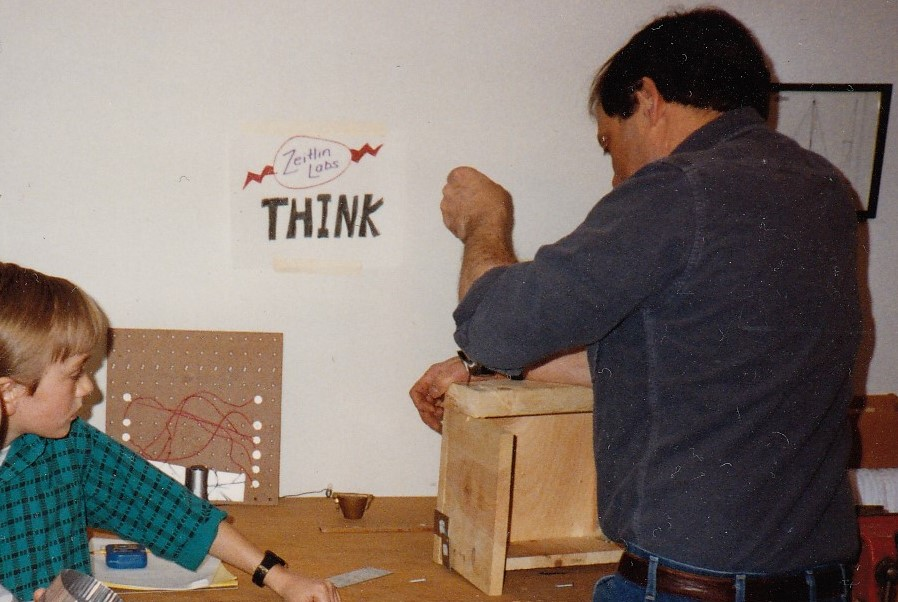

# Lab protocols and resources

[See the wiki](https://github.com/andrewzeitlin/ZeitlinLab/wiki) for guidelines.

Files stored in this repository provide:
- templates for use with LaTeX projects (articles and presentations);
- a model .gitignore and .gitattributes file (the latter requires git-lfs)

#  Lab members 

## Current members 

*Gui2de permanent staff*
- Beatrice Leydier (gui2de Data and Research Manager)
- Ali Hamza (gui2de Senior Data and Research Manager) 

*Student research assistants*
- Giuliana Daga (Research Assistant)
- Ana Gabriela Tamayo Alatriste (Research Assistant)
- Grace Han (Research Assistant)
- Aruj Shukla (Research Assistant)
- Showroop Pokhrel (Research Assistant)

## Lab alumni

- Richard Appell, Learning and Evaluation Specialist, BeTheBusiness.
- Sarait Cardenas-Rodriguez, Consultant, Inter-American Development Bank.
- Anirvan Chowdhury, Ph.D. student in Political Science, UC Berkeley.  
- Claire Cullen. DPhil student in Public Policy, Blavatnik School of Government, University of Oxford. 
- Robbie Dean. Research and Evaluation Specialist, Teach For All. 
- Sakari Deichsel, Economist, USAID. 
- Gerald Ipapa, Ph.D. student in Economics, University of Delaware.
- Sohum Patel, MD Candidate, Dartmouth Geisel School of Medicine.
- Saahil Karpe.  Research Analyst, DIME, World Bank.
- Samuel Solomon.  Ph.D. student in Economics, Yale University.
- Pooja Suri, Ph.D. student in Health Economics, UC Berkeley.

 
 

