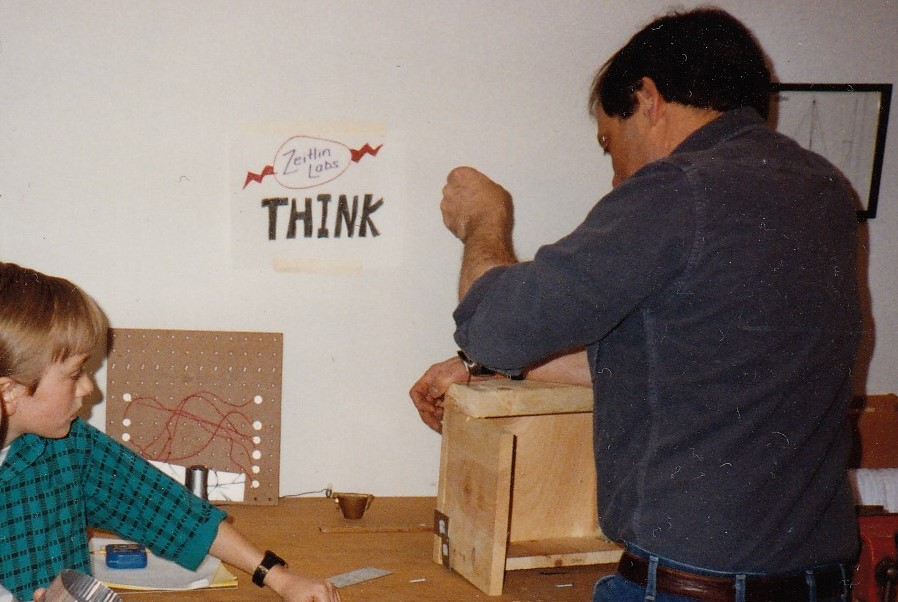

# Lab protocols and resources

[See the wiki](https://github.com/andrewzeitlin/ZeitlinLab/wiki) for guidelines.

Files stored in this repository provide:
- templates for use with LaTeX projects (articles and presentations);
- a model .gitignore and .gitattributes file (the latter requires git-lfs)

#  Lab members 

## Current members 

*Gui2de full-time staff*
- [Arnesh Chowdhury](https://gui2de.georgetown.edu/profiles/arnesh-chowdhury/) (Program Director, STARS)
- [Sean Hambali](https://gui2de.georgetown.edu/profiles/sean-hambali/) (Data and Research Associate)
- [Gerald Ipapa](https://sites.google.com/view/geraldipapa/home) (Postdoctoral Fellow)
- [Leodomir Mfura](https://www.wwhge.org/people/leo-mfura/) (Director, Gui2de Rwanda)
- [Béatrice Leydier](https://gui2de.georgetown.edu/profiles/beatrice-leydier/) (Research Director, What Works Hub for Global Education)

(Our work is also supported by Gui2de's Executive Director, [Whitney Tate](https://gui2de.georgetown.edu/profiles/whitney-tate/), and our work in Kenya is led locally by [Alex Wendo](https://gui2de.georgetown.edu/profiles/alex-wendo/))

*Student Research Assistants*
- Amy Azania (MIDP, 1st year)
- Sarah Mathey (DSPP, 2nd year)
- Ruby Frazer-Dalby (MIDP, 2nd year)
- Jenna Mazza (MIDP, 2nd year)
- Ethan Sager (MIDP, 2nd year)

## Lab alumni

Former lab members and placements:
- Richard Appell, Learning and Evaluation Specialist, BeTheBusiness.
- Elena Bagnera, Analyst, Climate Policy Initiative.
- Kryslette Bunyi, Financial Intelligence Analyst, Bangko Sentral ng Pilipinas.
- Enrico Lorenzo Campos
- Sarait Cardenas-Rodriguez, Consultant, Inter-American Development Bank.
- Anirvan Chowdhury, Ph.D. student in Political Science, UC Berkeley.  
- Kevin Conklin, Senior Research Associate, J-PAL and EPoD Morocco Employment Lab
- Claire Cullen, DPhil student in Public Policy, Blavatnik School of Government, University of Oxford. 
- Giuliana Daga, Research Fellow, Social Protection, Behavioral Science and Child Development, Inter-American Development Bank.  
- Robbie Dean, Research and Evaluation Specialist, Teach For All. 
- Sakari Deichsel, Economist, USAID. 
- Helena Dill, Consultant, World Bank.
- Lucas Fox, The Urban Institute.
- Chris Gray, Agriculture and Economic Diversification Program, Foundation for a Smoke-Free World.
- Brian Greenberg, International Rescue Committee.
- Maleeha Hameed, Center for Global Development.
- Grace Han, Center for Effective Global Action, University of California, Berkeley.
- Gerald Ipapa, Ph.D. student in Economics, University of Delaware.
- Saahil Karpe,  Research Analyst, DIME, World Bank.
- Deepika Nagesh
- Atsuhiro Oguri, Consultant, World Bank.
- Sohum Patel, MD Candidate, Dartmouth Geisel School of Medicine.
- Showroop Pokhrel, Analyst, Compass Lexecon.
- Hannah Reynolds
- Miti Shah
- Aruj Shukla,  Research Fellow, Center for Economic and Social Research, University of Southern California.
- Samuel Solomon,  Ph.D. student in Economics, Yale University.
- Priscila Stisman
- Pooja Suri, Ph.D. student in Health Economics, UC Berkeley.
- Rachel Swindle, Research Fellow, Georgetown Health Policy Institute. 
- Ana Gabriela Tamayo Alatriste, Senior Policy and Communications Associate, Innovations for Poverty Action.

 
 

